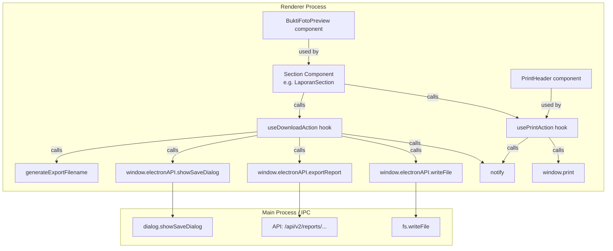
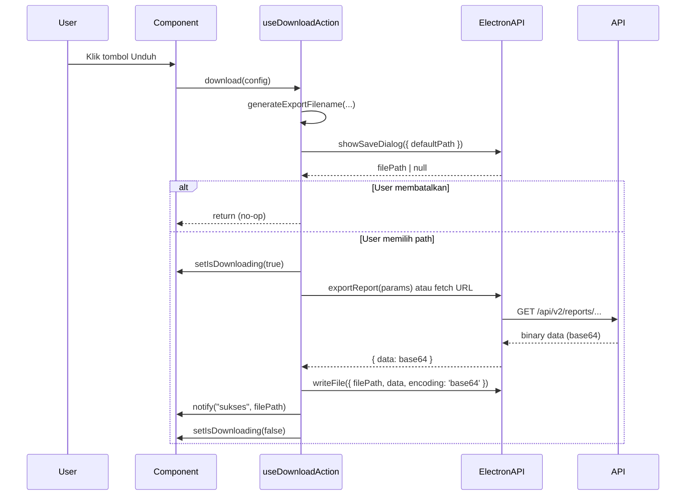
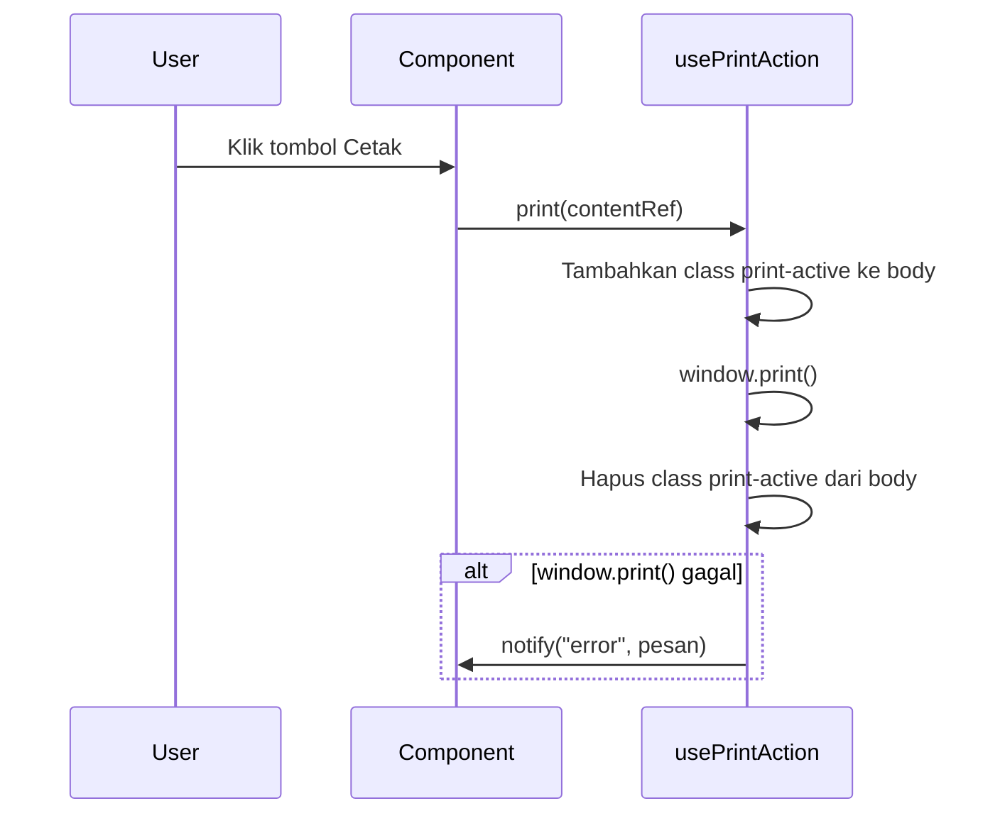

# Design Document: Download & Print Actions

## Overview

Fitur ini menambahkan kemampuan unduh (download) dan cetak (print) secara menyeluruh di seluruh aplikasi Absensholat Desktop. Setiap halaman yang menampilkan data — laporan absensi, data siswa, data guru, QR Code, riwayat kehadiran, dan detail izin — akan dilengkapi tombol unduh dan/atau cetak yang konsisten.

Pendekatan desain berfokus pada dua utilitas terpusat (`Export_Filename_Generator` dan logika download/print yang dapat digunakan ulang) yang dipanggil dari masing-masing komponen halaman. Infrastruktur IPC Electron yang sudah ada (`showSaveDialog`, `writeFile`, `exportReport`) dimanfaatkan sepenuhnya tanpa perlu menambahkan handler baru di main process.

### Keputusan Desain Utama

- **Tidak ada komponen wrapper baru untuk download/print** — logika diimplementasikan sebagai custom hooks (`useDownloadAction`, `usePrintAction`) dan satu fungsi murni (`generateExportFilename`). Ini lebih mudah diuji dan tidak menambah lapisan abstraksi yang tidak perlu.
- **SVG-to-PNG untuk QR Code** menggunakan Canvas API browser (tersedia di Electron renderer), bukan library eksternal.
- **Print menggunakan `window.print()`** dengan CSS `@media print` — pendekatan yang sudah terbukti dan tidak memerlukan dependensi tambahan.
- **CSV generation di sisi renderer** menggunakan serialisasi manual (tidak perlu library `papaparse` atau sejenisnya) karena data sudah tersedia sebagai array objek.

---

## Architecture



### Alur Download



### Alur Print



---

## Components and Interfaces

### 1. `generateExportFilename` (Pure Function)

File: `src/lib/export-filename.ts`

```typescript
export type ExportDataType =
  | 'laporan-absensi'
  | 'data-siswa'
  | 'qr-presensi'
  | 'riwayat-kehadiran'
  | 'riwayat-absensi-saya'
  | 'bukti-izin'
  | 'daftar-guru'

export type ExportFormat = 'xlsx' | 'csv' | 'pdf' | 'png'

export interface ExportFilenameOptions {
  dataType: ExportDataType
  format: ExportFormat
  date?: Date          // defaults to new Date()
  filter?: string      // e.g. jurusan name, "semua" if no filter
  studentName?: string // for riwayat-kehadiran
  nis?: string         // for riwayat-kehadiran
}

/**
 * Generates a consistent, filesystem-safe export filename.
 * Pure function — no side effects.
 */
export function generateExportFilename(options: ExportFilenameOptions): string
```

Aturan penamaan:
- Semua karakter dikonversi ke huruf kecil
- Spasi dan karakter non-alfanumerik (kecuali `-` dan `.`) diganti dengan `-`
- Tanggal selalu dalam format `YYYY-MM-DD`
- Panjang maksimum 255 karakter (dipotong sebelum ekstensi jika perlu)
- Filter kosong/undefined menggunakan nilai `"semua"`

Contoh output:
- `laporan-absensi-semua-2025-01-15.xlsx`
- `data-siswa-rpl-2025-01-15.csv`
- `qr-presensi-2025-01-15-0930.png`
- `riwayat-ahmad-budi-12345-2025-01-15.csv`
- `riwayat-absensi-saya-2025-01-15.csv`
- `daftar-guru-2025-01-15.csv`

### 2. `useDownloadAction` (Custom Hook)

File: `src/hooks/use-download-action.ts`

```typescript
export interface DownloadConfig {
  /** Filename generator options */
  filenameOptions: ExportFilenameOptions
  /** How to obtain the binary data to write */
  fetchData: () => Promise<{ data: string; encoding: 'base64' | 'utf8' }>
  /** File type filter for save dialog */
  dialogFilters?: Array<{ name: string; extensions: string[] }>
}

export interface UseDownloadActionReturn {
  isDownloading: boolean
  download: (config: DownloadConfig) => Promise<void>
}

export function useDownloadAction(): UseDownloadActionReturn
```

Perilaku:
1. Panggil `generateExportFilename` untuk mendapatkan `defaultPath`
2. Panggil `window.electronAPI.showSaveDialog({ defaultPath, filters })`
3. Jika `null` (dibatalkan), return tanpa efek
4. Set `isDownloading = true`, disable tombol
5. Panggil `config.fetchData()` untuk mendapatkan data
6. Panggil `window.electronAPI.writeFile({ filePath, data, encoding })`
7. Tampilkan notifikasi sukses dengan path file
8. Set `isDownloading = false`
9. Jika error di langkah 5–6, tampilkan notifikasi error dan set `isDownloading = false`

### 3. `usePrintAction` (Custom Hook)

File: `src/hooks/use-print-action.ts`

```typescript
export interface UsePrintActionReturn {
  print: () => void
}

export function usePrintAction(): UsePrintActionReturn
```

Perilaku:
1. Tambahkan class `printing` ke `document.body` (untuk CSS `@media print` targeting)
2. Panggil `window.print()`
3. Hapus class `printing` dari `document.body` setelah dialog cetak ditutup
4. Jika `window.print()` melempar error, tampilkan notifikasi error

### 4. `PrintHeader` (React Component)

File: `src/components/print-header.tsx`

```typescript
export interface PrintHeaderProps {
  title: string
  subtitle?: string
  filters?: Record<string, string>  // { "Jurusan": "RPL", "Kelas": "X RPL 1" }
  studentName?: string
  nis?: string
  printDate?: Date  // defaults to new Date()
}

export function PrintHeader(props: PrintHeaderProps): JSX.Element
```

Komponen ini hanya terlihat saat `@media print` aktif (menggunakan class `print:block hidden`). Menampilkan:
- Nama sekolah (dari konstanta aplikasi)
- Judul laporan
- Filter aktif (atau "Semua" jika tidak ada)
- Nama siswa + NIS (jika ada)
- Tanggal cetak dalam format `DD MMMM YYYY`

### 5. `BuktiFotoPreview` (React Component)

File: `src/components/bukti-foto-preview.tsx`

```typescript
export interface BuktiFotoPreviewProps {
  url: string
  fileName?: string
  onDownload: () => void
  isDownloading?: boolean
}

export function BuktiFotoPreview(props: BuktiFotoPreviewProps): JSX.Element
```

Mendeteksi tipe file dari URL:
- `.jpg`, `.jpeg`, `.png`, `.gif`, `.webp` → tampilkan `` preview
- `.pdf` → tampilkan ikon PDF + nama file
- Lainnya → tampilkan ikon file generik + nama file

### 6. Integrasi ke Komponen yang Ada

Setiap komponen yang ada ditambahkan tombol unduh/cetak di area header `CardHeader`. Tombol menggunakan ikon dari `lucide-react`:
- Unduh: `<Download className="size-4" />`
- Cetak: `<Printer className="size-4" />`

Tombol dinonaktifkan (`disabled`) dengan `opacity-50` dan `cursor-not-allowed` saat:
- Data masih loading (`isLoading === true`)
- Tidak ada data (`records.length === 0`)
- Operasi sedang berlangsung (`isDownloading === true`)

Tooltip menggunakan komponen `<Tooltip>` dari shadcn/ui untuk menjelaskan kondisi disabled.

---

## Data Models

### `ExportFilenameOptions`

```typescript
interface ExportFilenameOptions {
  dataType: ExportDataType   // Tipe data yang diekspor
  format: ExportFormat       // Format file output
  date?: Date                // Tanggal pembuatan (default: now)
  filter?: string            // Filter aktif (default: "semua")
  studentName?: string       // Nama siswa (untuk riwayat individual)
  nis?: string               // NIS siswa (untuk riwayat individual)
}
```

### `DownloadConfig`

```typescript
interface DownloadConfig {
  filenameOptions: ExportFilenameOptions
  fetchData: () => Promise<{ data: string; encoding: 'base64' | 'utf8' }>
  dialogFilters?: Array<{ name: string; extensions: string[] }>
}
```

### CSV Row Format (untuk data yang di-generate di renderer)

Data siswa, guru, dan riwayat kehadiran yang sudah ada di state komponen di-serialize ke CSV di sisi renderer menggunakan fungsi helper:

```typescript
function arrayToCsv(headers: string[], rows: string[][]): string {
  const escape = (v: string) => `"${v.replace(/"/g, '""')}"`
  return [headers, ...rows].map(row => row.map(escape).join(',')).join('\n')
}
```

Data ini kemudian di-encode ke base64 untuk ditulis via `writeFile`.

### QR Code PNG Conversion

Konversi SVG QR Code ke PNG menggunakan Canvas API:

```typescript
async function svgElementToPngBase64(
  svgElement: SVGElement,
  size: number = 512
): Promise<string>
```

1. Serialize SVG ke string menggunakan `XMLSerializer`
2. Buat `Image` dari data URL SVG
3. Gambar ke `<canvas>` berukuran `size × size`
4. Export canvas ke PNG base64 via `canvas.toDataURL('image/png')`

---

## Correctness Properties

*A property is a characteristic or behavior that should hold true across all valid executions of a system — essentially, a formal statement about what the system should do. Properties serve as the bridge between human-readable specifications and machine-verifiable correctness guarantees.*

### Property 1: Filename Character Safety

*For any* valid combination of `ExportFilenameOptions` inputs, `generateExportFilename` SHALL produce a string that contains only lowercase alphanumeric characters, hyphens (`-`), and dots (`.`), and has a length of at most 255 characters.

**Validates: Requirements 14.1**

---

### Property 2: Filename Always Contains Date

*For any* valid `ExportFilenameOptions` input, `generateExportFilename` SHALL produce a string that contains a substring matching the pattern `\d{4}-\d{2}-\d{2}` (ISO date format).

**Validates: Requirements 14.2**

---

### Property 3: Filename Extension Matches Format

*For any* valid `ExportFilenameOptions` with a given `format`, `generateExportFilename` SHALL produce a string ending with `.xlsx` when format is `'xlsx'`, `.csv` when format is `'csv'`, `.pdf` when format is `'pdf'`, and `.png` when format is `'png'`.

**Validates: Requirements 14.4**

---

### Property 4: Filename Uniqueness Across Inputs

*For any* two distinct `ExportFilenameOptions` tuples that differ in at least one of `dataType`, `date`, or `filter`, `generateExportFilename` SHALL produce different output strings.

**Validates: Requirements 14.3**

---

### Property 5: Download Validation Blocks Confirm

*For any* download configuration dialog state where `downloadRange === 'custom'` and at least one of `customStartDate` or `customEndDate` is null, undefined, or an empty string, the confirm download button SHALL be disabled (have the `disabled` attribute).

**Validates: Requirements 1.2**

---

### Property 6: Error Notification on Any Download Failure

*For any* error thrown by `fetchData` (network error, API error, file write error) during a download operation, `useDownloadAction` SHALL call `notify` with severity `'error'` and SHALL set `isDownloading` back to `false`.

**Validates: Requirements 1.6, 7.4, 9.4, 11.6, 13.4**

---

### Property 7: Error Notification on Any Print Failure

*For any* error thrown by `window.print()` during a print operation, `usePrintAction` SHALL call `notify` with severity `'error'`.

**Validates: Requirements 2.3, 4.2, 6.4, 8.4, 10.4, 12.3**

---

### Property 8: Active Filter Passed to Export

*For any* active kelas or jurusan filter value in LaporanSection, when a download is confirmed, `window.electronAPI.exportReport` SHALL be called with that filter value as the corresponding query parameter.

**Validates: Requirements 1.8**

---

### Property 9: Print Header Renders Student Identity

*For any* `PrintHeaderProps` with non-empty `studentName` and `nis`, the rendered `PrintHeader` component SHALL contain both the `studentName` and `nis` values in its output.

**Validates: Requirements 8.5, 10.5, 12.4**

---

### Property 10: Print Header Renders Active Filters

*For any* `PrintHeaderProps` with a non-empty `filters` map, the rendered `PrintHeader` component SHALL contain each filter value in its output.

**Validates: Requirements 4.4**

---

### Property 11: Bukti File Type Detection

*For any* URL string, `BuktiFotoPreview` SHALL render an `` element when the URL ends with `.jpg`, `.jpeg`, `.png`, `.gif`, or `.webp`; a PDF icon when the URL ends with `.pdf`; and a generic file icon for all other extensions.

**Validates: Requirements 11.3, 11.4, 11.5**

---

### Property 12: Disabled Button Has Tooltip

*For any* download or print button that is rendered in a disabled state (due to loading or no data), the button SHALL have a tooltip element that is non-empty.

**Validates: Requirements 15.4**

---

## Error Handling

### Download Errors

| Kondisi | Penanganan |
|---|---|
| User membatalkan save dialog | Silent return, tidak ada notifikasi, state tidak berubah |
| API/network error saat `exportReport` | `notify("Gagal mengunduh: {pesan error}", "error")`, `isDownloading = false` |
| `writeFile` gagal (disk penuh, permission) | `notify("Gagal menyimpan file: {pesan error}", "error")`, `isDownloading = false` |
| SVG-to-PNG conversion gagal | `notify("Gagal mengkonversi QR Code ke gambar", "error")` |
| Tidak ada data saat tombol diklik | `notify("Tidak ada data untuk diunduh", "warning")`, save dialog tidak dibuka |
| Data masih loading | Tombol disabled, tidak ada aksi |

### Print Errors

| Kondisi | Penanganan |
|---|---|
| `window.print()` melempar exception | `notify("Gagal membuka dialog cetak: {pesan error}", "error")` |
| Tidak ada data saat tombol diklik | Tombol disabled dengan tooltip, tidak ada aksi |
| Data masih loading | Tombol disabled dengan tooltip, tidak ada aksi |

### Validasi Input Download Dialog

- Rentang kustom dengan tanggal tidak valid: tombol konfirmasi disabled + pesan validasi inline
- Tanggal akhir sebelum tanggal awal: tombol konfirmasi disabled + pesan validasi inline

---

## Testing Strategy

### Pendekatan Dual Testing

Fitur ini menggunakan dua lapisan pengujian yang saling melengkapi:

1. **Unit tests** — untuk skenario spesifik, edge case, dan interaksi UI
2. **Property-based tests** — untuk properti universal yang harus berlaku di semua input valid

Library PBT yang digunakan: **`fast-check`** (tersedia untuk TypeScript/JavaScript, terintegrasi dengan Vitest).

Instalasi: `npm install --save-dev fast-check`

Setiap property test dikonfigurasi dengan minimum **100 iterasi** (default fast-check).

### Unit Tests

File: `src/__tests__/lib/export-filename.test.ts`
- Verifikasi format output untuk setiap `dataType`
- Verifikasi penanganan karakter spesial dalam nama siswa/filter
- Verifikasi pemotongan nama file yang terlalu panjang

File: `src/__tests__/hooks/use-download-action.test.ts`
- Skenario sukses: mock `showSaveDialog` → path, mock `fetchData` → data, assert `writeFile` dipanggil
- Skenario batal: mock `showSaveDialog` → null, assert `writeFile` tidak dipanggil
- Skenario error: mock `fetchData` → throw, assert `notify("error")` dipanggil

File: `src/__tests__/components/PrintHeader.test.tsx`
- Render dengan berbagai kombinasi props, assert konten yang diharapkan ada

File: `src/__tests__/components/BuktiFotoPreview.test.tsx`
- Render dengan URL gambar, PDF, dan file lain, assert elemen yang tepat dirender

### Property-Based Tests

File: `src/__tests__/lib/export-filename.property.test.ts`

```typescript
import fc from 'fast-check'
import { describe, it, expect } from 'vitest'
import { generateExportFilename } from '@/lib/export-filename'

// Feature: download-print-actions, Property 1: Filename Character Safety
it('Property 1: filename only contains safe characters and is ≤255 chars', () => {
  fc.assert(fc.property(
    fc.record({
      dataType: fc.constantFrom('laporan-absensi', 'data-siswa', 'qr-presensi', ...),
      format: fc.constantFrom('xlsx', 'csv', 'pdf', 'png'),
      date: fc.date(),
      filter: fc.option(fc.string()),
      studentName: fc.option(fc.string()),
      nis: fc.option(fc.string()),
    }),
    (opts) => {
      const filename = generateExportFilename(opts)
      expect(filename).toMatch(/^[a-z0-9.\-]+$/)
      expect(filename.length).toBeLessThanOrEqual(255)
    }
  ))
})

// Feature: download-print-actions, Property 2: Filename Always Contains Date
it('Property 2: filename always contains YYYY-MM-DD date', () => {
  fc.assert(fc.property(
    validFilenameOptionsArbitrary,
    (opts) => {
      const filename = generateExportFilename(opts)
      expect(filename).toMatch(/\d{4}-\d{2}-\d{2}/)
    }
  ))
})

// Feature: download-print-actions, Property 3: Filename Extension Matches Format
it('Property 3: filename extension matches format', () => {
  fc.assert(fc.property(
    fc.record({
      dataType: fc.constantFrom(...),
      format: fc.constantFrom('xlsx', 'csv', 'pdf', 'png'),
    }),
    ({ dataType, format }) => {
      const filename = generateExportFilename({ dataType, format })
      expect(filename).toMatch(new RegExp(`\\.${format}$`))
    }
  ))
})

// Feature: download-print-actions, Property 4: Filename Uniqueness
it('Property 4: different inputs produce different filenames', () => {
  fc.assert(fc.property(
    fc.tuple(validFilenameOptionsArbitrary, validFilenameOptionsArbitrary).filter(
      ([a, b]) => a.dataType !== b.dataType || a.date?.toDateString() !== b.date?.toDateString() || a.filter !== b.filter
    ),
    ([optsA, optsB]) => {
      expect(generateExportFilename(optsA)).not.toBe(generateExportFilename(optsB))
    }
  ))
})
```

File: `src/__tests__/hooks/use-download-action.property.test.ts`

```typescript
// Feature: download-print-actions, Property 6: Error Notification on Any Download Failure
it('Property 6: any fetchData error triggers error notification', () => {
  fc.assert(fc.property(
    fc.string(), // arbitrary error message
    async (errorMessage) => {
      const { result } = renderHook(() => useDownloadAction())
      mockShowSaveDialog.mockResolvedValue('/some/path.csv')
      const config = {
        filenameOptions: { dataType: 'data-siswa', format: 'csv' },
        fetchData: () => Promise.reject(new Error(errorMessage)),
      }
      await act(() => result.current.download(config))
      expect(mockNotify).toHaveBeenCalledWith(expect.stringContaining(''), 'error')
      expect(result.current.isDownloading).toBe(false)
    }
  ))
})
```

File: `src/__tests__/components/BuktiFotoPreview.property.test.ts`

```typescript
// Feature: download-print-actions, Property 11: Bukti File Type Detection
it('Property 11: image URLs render img element', () => {
  fc.assert(fc.property(
    fc.constantFrom('.jpg', '.jpeg', '.png', '.gif', '.webp').chain(
      ext => fc.string().map(s => `https://example.com/${s}${ext}`)
    ),
    (url) => {
      const { container } = render(<BuktiFotoPreview url={url} onDownload={() => {}} />)
      expect(container.querySelector('img')).not.toBeNull()
    }
  ))
})
```

### Integration Tests

- Verifikasi bahwa `exportReport` IPC handler mengembalikan data binary yang valid untuk setiap format
- Verifikasi bahwa `showSaveDialog` + `writeFile` menghasilkan file yang dapat dibaca

### Smoke Tests (Manual)

- Verifikasi tampilan `@media print` di setiap halaman (sidebar tersembunyi, header cetak muncul)
- Verifikasi ikon unduh dan cetak konsisten di seluruh aplikasi
- Verifikasi posisi tombol di ujung kanan header
- Verifikasi tooltip muncul dalam ≤500ms pada tombol disabled
